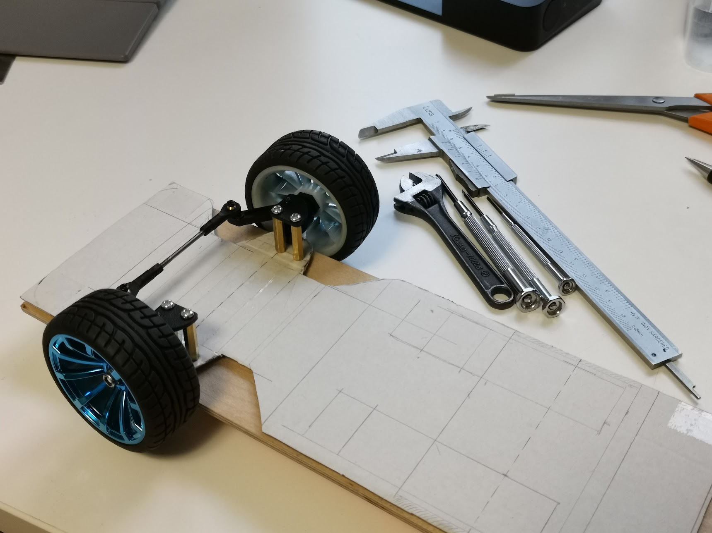
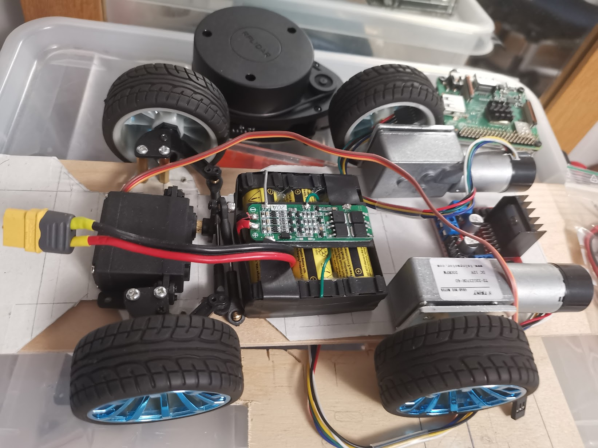

# Pet-Mk-VII

<h1 align="center">Welcome to the Pet-Mk-VII repository</h1>
<h1 align="center">The ROS2 Ackermann Vehicle/Robot</h1>

ROS2 repository in the https://github.com/Pet-Series Git-Organizations.</br>
Containing multiply ROS1/ROS2-packages (Robot Operating System).<br>
⚠️*This repository are under construction... As well as the documentation and robot itself*⚠️

# Software/Setup Pet series micro robots #
The main objective/scope for this repository is to control the part of the software (and parameter settings) that is unique for this Pet Mark VII (seven) robot. A.k.a "The Ackermann".

**Ubuntu** is used as operating system<br>
**Docker** is used as image/container system for ROS2<br>
**ROS2** is used as middleware<br>

# The journey is the goal
<table>
    <tr>Pet-Mk.VII early iterations
      <td>..image 1...<br></td>
      <td>..image 1...<br></td>
    </tr>
</table>

# SETUP ROS2 WORKSPACE
## Create source directory
`Ubuntu Shell`
```
~$ mkdir -p ~/ws_ros2_jazzy/src
~$ cd ~/ws_ros2_jazzy/src
```
## Clone git repositories
`Ubuntu Shell`
```
~/ws_ros2_jazzy/src$ git clone https://github.com/Pet-Series/Pet-Mk-VII
   ...
~/ws_ros2_jazzy/src$ git clone https://github.com/Pet-Series/pet_ros2_lightbeacon_pkg.git
   ...
~/ws_ros2_jazzy/src$ git clone https://github.com/Pet-Series/pet_ros2_ir_remote_pkg.git
   ...
~/ws_ros2_jazzy/src$ git clone https://github.com/Pet-Series/pet_ros2_lcd_pkg.git
   ...
~/ws_ros2_jazzy/src$ git clone https://github.com/lucasmazzetto/gazebo_ackermann_steering_vehicle.git
   ...
~/ws_ros2_jazzy/src$
```

## Build workspace
`Ubuntu Shell`
```
~/ws_ros2_jazzy$ source /opt/ros/jazzy/setup.bash
   ...
~/ws_ros2_jazzy$ colcon build
   ...
~/ws_ros2_jazzy$ source install/setup.bash
```

## Launch basic Gazebo vehicle
`Ubuntu Shell`
```
~/ws_ros2_jazzy$ ros2 launch pet_mk_vii_simulation vehicle.launch.py
   ...
~/ws_ros2_jazzy$
```
